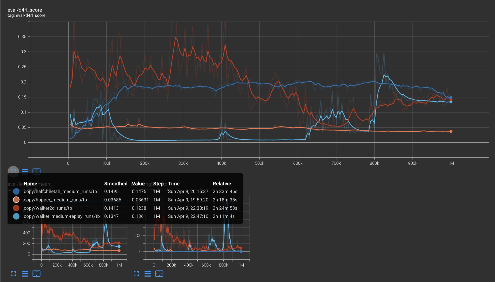
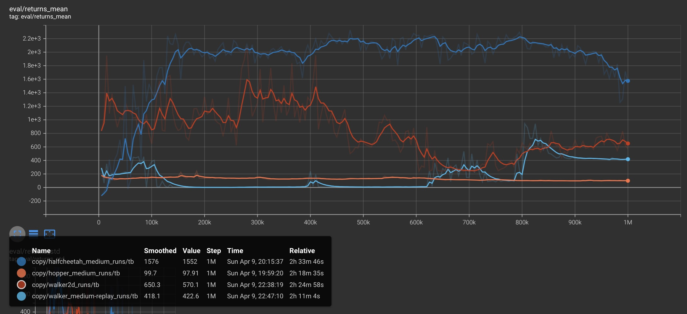

# Offline-to-Online Reinforcement Learning
This repository contains experiments of different reinforcement learning algorithms applied to 3 MuJoCo environments - `Walker2d, Hopper and Halfcheetah`. Essentially, there are 2 models in comparison: Adaptive Behavior Cloning Regularization [1] (in short, `redq_bc`) and Supported Policy Optimization for Offline Reinforcement Learning [2] (in short, `spot`).

## General setup
I've chosen these datasets from gym as they are from MuJoCo, i.e. require learning of complex underlying structufe of the given task with trade-off in short-term and long-term strategies and Google Colab doesn't die from them ;). I have also used `d4rl` [3] library at https://github.com/tinkoff-ai/d4rl as a module to get offline dataset. Datasets used from `d4rl` for environments mentioned above: `medium` and `medium-replay`. 

Models (both redq_bc and spot) were trained on this offline dataset first using `Adam` optimizer with `lr = 3e-4`. The same with online training. Scripts can be found in appropriate folders (`adaptive_bc` and `spot`)

## Models

All available models can be tested in colab opening `inference.ipynb`. Examples of evaluation can be found in `video` folder.

### Adaptive Behavior Cloning Regularization for Stable Offline-to-Online Reinforcement Learning
redq_bc is implemented to adaptively weigh the L2 loss associated with offline dataset distribution during online fine-tuning on order to stabilise the training. This loss is constructed into the architecture to prevent sudden distribution shift from offline to online data with such simple regularisation that requires minimum code changes (the method is located in the `adaptive_bc` folder, there is also `paper` folder with key moments from the following paper to realise the model). Logs are available at: https://wandb.ai/zzmtsvv/adaptive_bc

https://user-images.githubusercontent.com/85760987/230909607-2296499e-e0bf-4f7d-b1ae-f1947bd06bc7.mp4

### Supported Policy Optimization for Offline Reinforcement Learning

spot is also implemented to mitigate the problem of the distribution shift by adding a density-based constraint to the main objective. The offline behavior density is realised with Conditional VAE ([4], [5]) that reconstructs action joint with condition (state in this case). ...

https://user-images.githubusercontent.com/85760987/230911037-dc138bc0-7eda-42f8-9881-92f425a2d131.mp4

https://user-images.githubusercontent.com/85760987/230911045-41823337-cc23-4c2f-9409-800739337310.mp4

 | 

## Results
compare 2 models

## References
[1] - Yi Zhao et al. (2022). Adaptive Behavior Cloning Regularization for Stable Offline-to-Online Reinforcement Learning. Available at: https://arxiv.org/abs/2210.13846  
[2] - Jialong Wu et al. (2022). Supported Policy Optimization for Offline Reinforcement Learning. Available at: https://arxiv.org/abs/2202.06239  
[3] - Justin Fu et al. (2021). D4RL: DATASETS FOR DEEP DATA-DRIVEN REINFORCEMENT LEARNING. Available at: https://arxiv.org/abs/2004.07219  
[4] - Kingma, Welling et al. (2014). Auto-Encoding Variational Bayes. Available at: https://arxiv.org/abs/1312.6114  
[5] - Sohn, Lee, Yan et al. (2015). Learning Structured Output Representation using Deep Conditional Generative Models. Available at: https://papers.nips.cc/paper_files/paper/2015/hash/8d55a249e6baa5c06772297520da2051-Abstract.html
